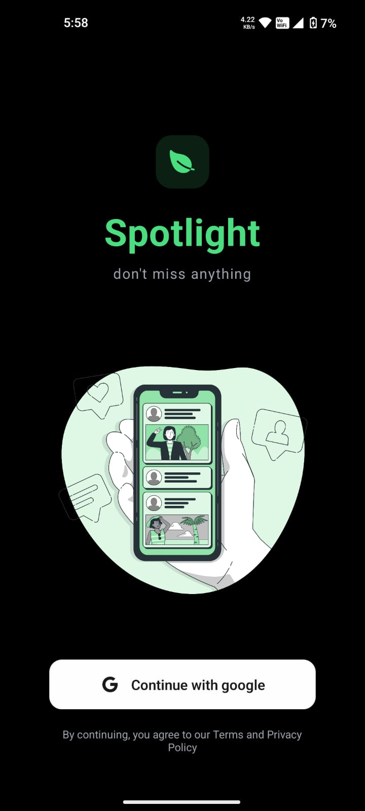
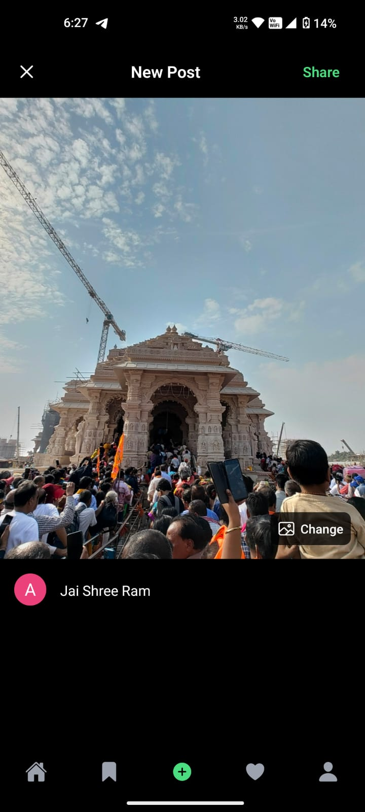
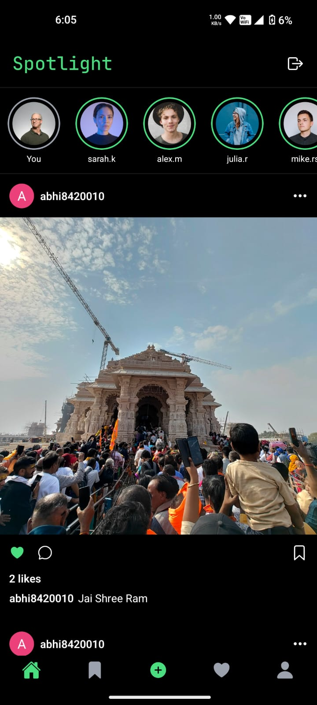
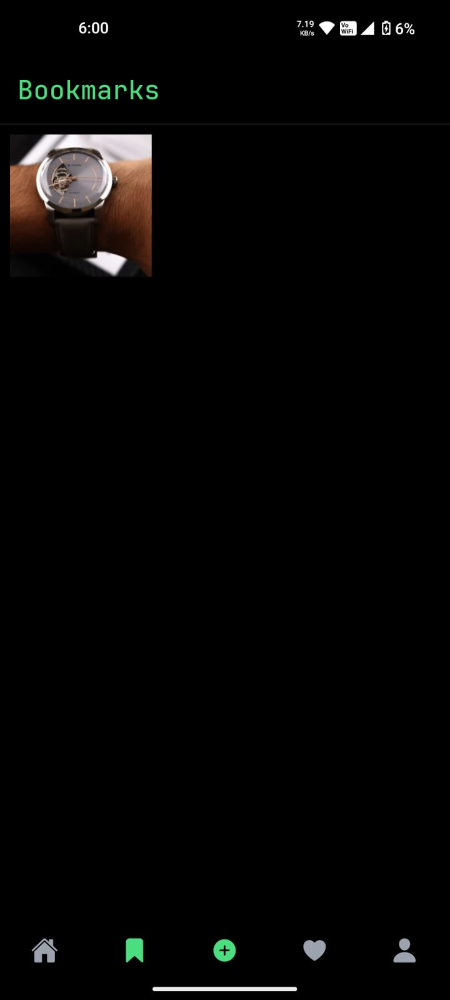
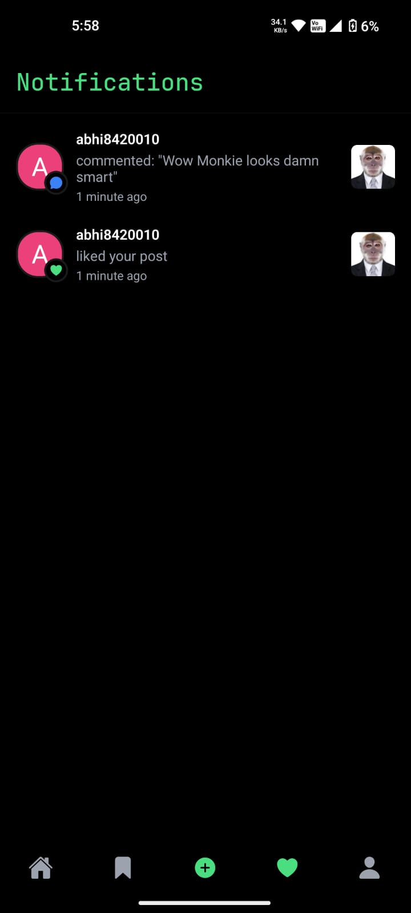

# 📸 Spotlight - A Social Media App

Spotlight is a dynamic social media app built using **React Native** and **Expo**, designed to deliver a smooth and interactive experience. Inspired by platforms like Instagram, Spotlight allows users to share, engage, and explore content effortlessly.

    
  

---

## ✨ Features

✅ **Create Posts** – Share your moments through posts with text and images.  
✅ **Feed Page** – Scroll through posts shared by users.  
✅ **Bookmarks** – Save posts you like for later viewing.  
✅ **Notifications** – Stay updated with likes, comments, and follows.  
✅ **Sign In / Sign Up** – Secure authentication flow for easy access.  
✅ **Profile Page** – Manage your personal profile, edit bio, profile picture, and more.  
✅ **Public Profiles** – View other users’ public profiles and posts.  
✅ **Likes and Comments** – Like and comment on posts to engage with the community.  
✅ **Responsive UI** – Seamless experience across all devices.

---

## 🛠️ Tech Stack

- **React Native** – Cross-platform mobile development
- **Expo** – Fast development and easy testing
- **TypeScript** – Type-safe codebase
- **Convex** – Backend as a service with real-time capabilities
- **Clerk** – Authentication and user management
- **NativeWind** – Utility-first styling for React Native
- **Expo Router** – Smooth navigation between screens

---

## 📱 App Structure

- **Home Feed** – Discover the latest posts from the community
- **Create Post** – Share your own posts with images and text
- **Profile Page** – Manage your information and view your posts
- **Public Profile Page** – Explore profiles of other users
- **Bookmarks** – Quickly access your favorite posts
- **Notifications** – View updates about your likes, comments, and follows
- **Authentication** – Secure Sign In / Sign Up process

---

## 🚀 Getting Started

Follow these steps to run the project locally:

1. **Clone the repository**
```bash
git clone https://github.com/abhiiishek07/spotlight.git
```
2. **Install Dependencies**
```bash
npm install
# or
yarn install
```

3. **Set up environment variables**
```bash
Create a .env.local file at the root and add your API keys and configuration for Convex, Clerk, etc
```

4. **Start the development server**
```bash
npx expo start
```